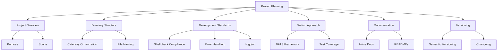

# Bash Tools - Project Planning



## Project Overview
- **Purpose**: Collection of reusable bash scripts for system administration and development tasks
- **Scope**: 
  - System utilities (apt, sys-utils)
  - Development tools (docker, git, python)
  - Environment configuration (dotfiles)
  - Experimental scripts (experiments)

## Directory Structure
```
bash-tools/
├── category/          # Each category has its own directory
│   ├── tool.sh        # Individual tool scripts
│   └── README.md      # Category documentation
├── tests/             # BATS test files
├── utils/             # Shared utility functions
├── install.sh         # Installation script
└── README.md          # Project documentation
```

## Development Standards
1. **Code Quality**
   - Must pass Shellcheck validation
   - Use `set -euo pipefail` in all scripts
   - Follow Google Shell Style Guide

2. **Error Handling**
   - Use trap for cleanup
   - Consistent error messages
   - Proper exit codes

3. **Logging**
   - Standardized log format
   - Verbosity levels
   - Log rotation consideration

## Testing Approach
- **BATS Framework** for unit testing
- Test files mirror script structure
- Minimum 80% test coverage
- CI integration with GitHub Actions

## Documentation
1. **Inline Documentation**
   - Function headers with usage examples
   - Parameter descriptions
   - Return values

2. **Project Documentation**
   - Category-level READMEs
   - Installation instructions
   - Contribution guidelines

## Versioning
- Semantic Versioning (MAJOR.MINOR.PATCH)
- CHANGELOG.md for release notes
- Tagged releases in Git
- Backward compatibility considerations

## Workflow
1. Development
   - Create feature branch
   - Add tests for new functionality
   - Document changes

2. Review
   - Shellcheck validation
   - Test coverage verification
   - Peer review

3. Release
   - Update version
   - Update CHANGELOG.md
   - Create release tag